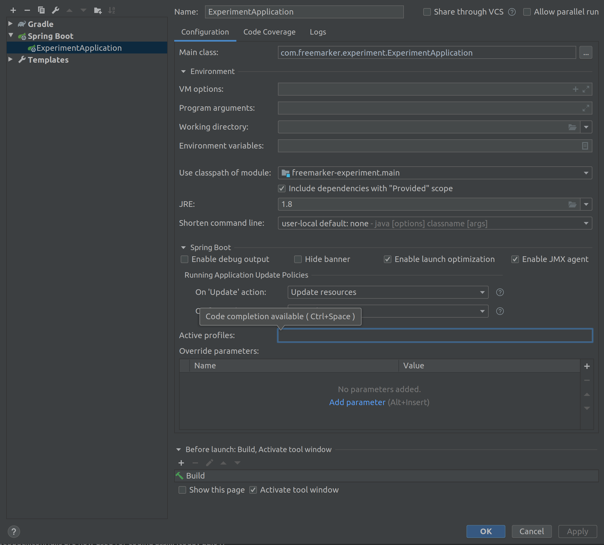

Freemarker experiment
==================

Learning to create a freemarker based spring boot app.

## Requirements

- nodejs
- yarn
- `npm i -g commitizen`

## Committing

Should be done using commitizen, so use `yarn commit` instead of `git commit`.

## Intellij configuration

I've left my settings in the root folder in an image called intellij-debug-configuration.png.

## Development

If you only change 